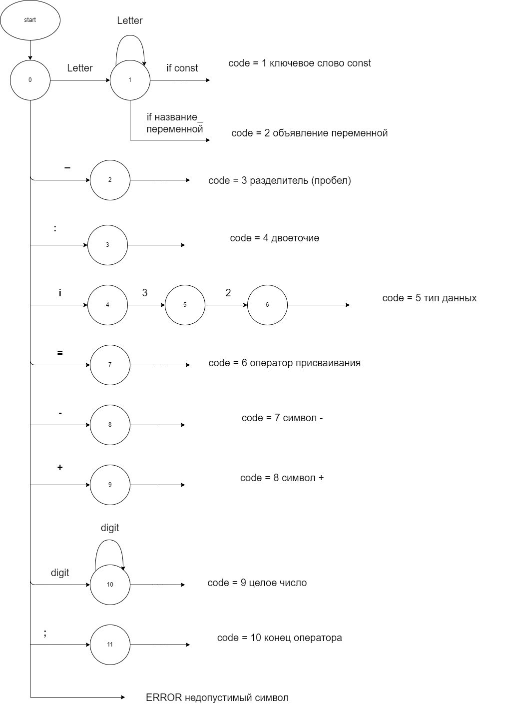

Цель: Изучить назначение лексического анализатора. Спроектировать алгоритм и выполнить программную реализацию сканера.</h1>
Вариант: Объявление целочисленной константы с инициализацией на языке Rust</h2>

Примеры верных строк:
const MARKS:i32 = 100;
const NUM:i32 = 5;
const NUMBER:i32 = 76564;

Тестовые примеры:
